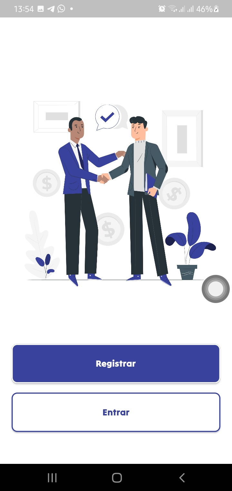
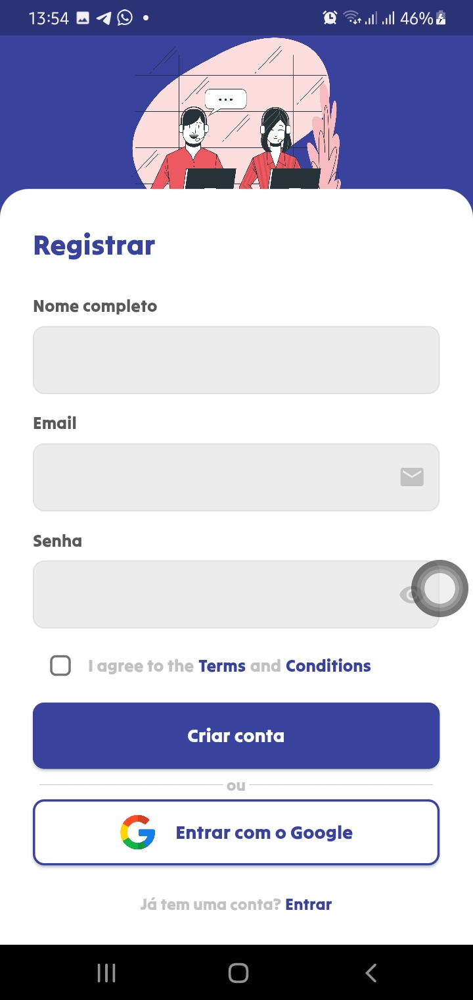
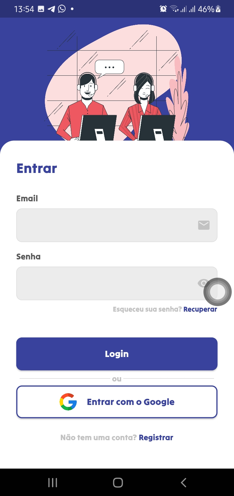
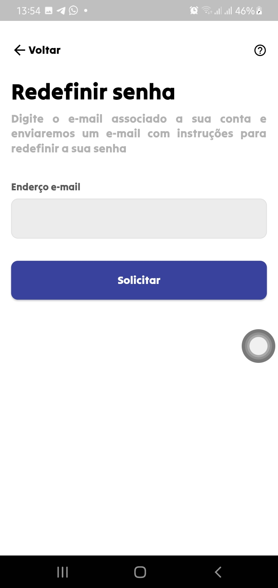
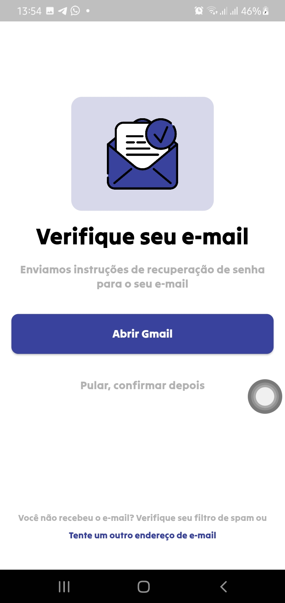
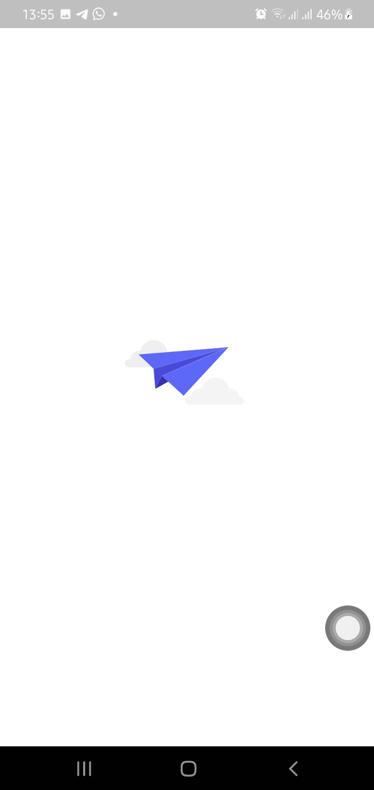
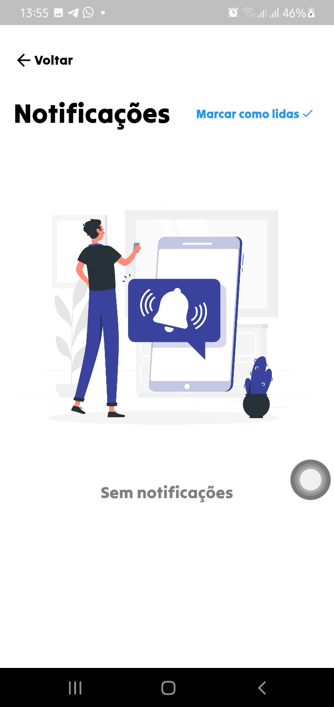
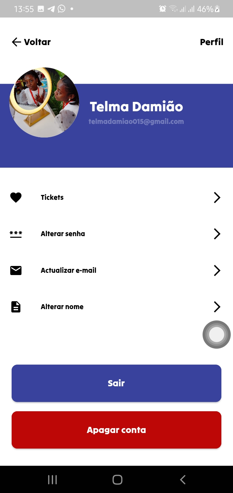

# e-Support👨🏽‍💻

## Receba suportes técnicos pela e-Support

## Passos:
  - Após o clone do repositório
  - Actualize as dependências rodando: flutter pub get
  - Gere um apk: flutter build apk | Rode o projecto: flutter run

## Telas
  ### Splash Screen
  
  
  ### Auth Screen
  
  
  ### Register Screen
  
  
  ### Login Screen
  
 
  ### Recover Password Screen
  
  
  ### Verify Email Screen
  
  
  ### Loading Screen
  
  
  ### Notifications Screen
  
 
  ### Profile Screen
  
